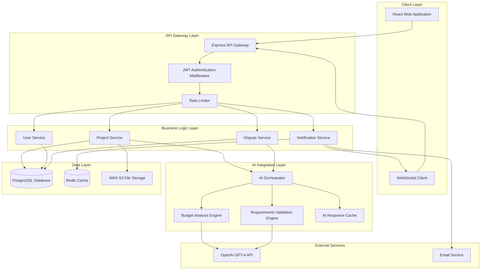

# Design Document: AI-Powered Freelancer Project Management

## Overview

The AI-Powered Freelancer Project Management Application is built on a three-tier architecture with a React-based frontend, Node.js/Express backend API, and PostgreSQL database. The system integrates with OpenAI's GPT-4 API for intelligent budget analysis and requirements validation. The architecture emphasizes separation of concerns, with distinct layers for presentation, business logic, AI integration, and data persistence.

The application follows an event-driven workflow where user actions trigger AI analysis at critical decision points. The system maintains complete audit trails and supports real-time notifications through WebSocket connections. Security is implemented through JWT-based authentication with role-based access control.

## Architecture

### System Architecture Diagram



### Technology Stack

**Frontend:**
- React 18 with TypeScript
- Redux Toolkit for state management
- React Query for server state
- Socket.io-client for real-time updates
- Tailwind CSS for styling

**Backend:**
- Node.js 20 with Express
- TypeScript for type safety
- Socket.io for WebSocket support
- Bull for job queue management

**Database:**
- PostgreSQL 15 for relational data
- Redis 7 for caching and session management
- AWS S3 for file storage

**AI Integration:**
- OpenAI GPT-4 API for analysis
- Custom prompt engineering for budget and requirements validation

**Infrastructure:**
- Docker for containerization
- AWS ECS for deployment
- CloudWatch for monitoring

## Components and Interfaces

### 1. User Management Component

**Responsibilities:**
- User registration and authentication
- Profile management
- Role-based access control
- Session management

**Interfaces:**

```typescript
interface User {
  id: string;
  email: string;
  passwordHash: string;
  role: 'client' | 'freelancer' | 'admin';
  profile: UserProfile;
  createdAt: Date;
  lastLoginAt: Date;
  twoFactorEnabled: boolean;
}

interface UserProfile {
  firstName: string;
  lastName: string;
  avatar?: string;
  bio?: string;
  skills?: string[];
  hourlyRate?: number;
}

interface AuthToken {
  accessToken: string;
  refreshToken: string;
  expiresIn: number;
}

// API Endpoints
POST   /api/auth/register
POST   /api/auth/login
POST   /api/auth/refresh
POST   /api/auth/logout
GET    /api/users/profile
PUT    /api/users/profile
```

### 2. Project Management Component

**Responsibilities:**
- Project creation and validation
- Project lifecycle management
- Deliverable handling
- Status tracking

**Interfaces:**

```typescript
interface Project {
  id: string;
  clientId: string;
  freelancerId?: string;
  title: string;
  description: string;
  deliverables: Deliverable[];
  budget: number;
  timeline: Timeline;
  category: ProjectCategory;
  status: ProjectStatus;
  createdAt: Date;
  updatedAt: Date;
}

interface Deliverable {
  id: string;
  name: string;
  description: string;
  required: boolean;
  fileUrls?: string[];
  status: 'pending' | 'submitted' | 'approved';
}

interface Timeline {
  startDate?: Date;
  endDate?: Date;
  estimatedHours?: number;
}

type ProjectStatus = 
  | 'draft'
  | 'submitted'
  | 'budget_analysis'
  | 'available'
  | 'assigned'
  | 'in_progress'
  | 'completed'
  | 'under_review'
  | 'validated'
  | 'approved'
  | 'disputed'
  | 'closed';

type ProjectCategory = 
  | 'web_development'
  | 'mobile_development'
  | 'design'
  | 'writing'
  | 'marketing'
  | 'other';

// API Endpoints
POST   /api/projects
GET    /api/projects/:id
PUT    /api/projects/:id
GET    /api/projects/client/:clientId
GET    /api/projects/freelancer/:freelancerId
POST   /api/projects/:id/assign
POST   /api/projects/:id/complete
POST   /api/projects/:id/approve
```

### 3. AI Budget Analysis Component

**Responsibilities:**
- Analyze project requirements against budget
- Generate confidence scores
- Provide budget recommendations
- Cache analysis results

**Interfaces:**

```typescript
interface BudgetAnalysisRequest {
  projectId: string;
  title: string;
  description: string;
  deliverables: Deliverable[];
  budget: number;
  timeline: Timeline;
  category: ProjectCategory;
}

interface BudgetAnalysisResult {
  projectId: string;
  status: 'aligned' | 'misaligned';
  confidenceScore: number; // 0-100
  analysis: string;
  recommendations?: BudgetRecommendation;
  analyzedAt: Date;
  processingTimeMs: number;
}

interface BudgetRecommendation {
  suggestedMinBudget?: number;
  suggestedMaxBudget?: number;
  reasoning: string;
  riskFactors: string[];
}

// API Endpoints
POST   /api/ai/budget-analysis
GET    /api/ai/budget-analysis/:projectId
```

**AI Prompt Structure:**

```typescript
const BUDGET_ANALYSIS_PROMPT = `
You are an expert project manager analyzing freelance project budgets.

Project Details:
- Title: {title}
- Category: {category}
- Description: {description}
- Deliverables: {deliverables}
- Timeline: {timeline}
- Proposed Budget: ${budget}

Analyze if the budget is appropriate for this project scope. Consider:
1. Complexity of deliverables
2. Time requirements
3. Market rates for {category}
4. Scope clarity and completeness

Provide:
1. Confidence score (0-100) for budget appropriateness
2. Status: "aligned" or "misaligned"
3. Detailed reasoning
4. Suggested budget range if misaligned
5. Risk factors

Format response as JSON.
`;
```

### 4. AI Requirements Validation Component

**Responsibilities:**
- Validate deliverables against requirements
- Generate assessment scores
- Identify missing or incomplete work
- Support dispute re-analysis

**Interfaces:**

```typescript
interface RequirementsValidationRequest {
  projectId: string;
  originalRequirements: {
    description: string;
    deliverables: Deliverable[];
  };
  submittedWork: {
    deliverables: SubmittedDeliverable[];
    notes: string;
  };
  disputeEvidence?: DisputeEvidence;
}

interface SubmittedDeliverable {
  deliverableId: string;
  fileUrls: string[];
  description: string;
  metadata: FileMetadata[];
}

interface FileMetadata {
  filename: string;
  size: number;
  mimeType: string;
  uploadedAt: Date;
}

interface RequirementsValidationResult {
  projectId: string;
  status: 'requirements_met' | 'requirements_partially_met';
  assessmentScore: number; // 0-100
  overallAnalysis: string;
  deliverableAssessments: DeliverableAssessment[];
  validatedAt: Date;
  processingTimeMs: number;
}

interface DeliverableAssessment {
  deliverableId: string;
  status: 'complete' | 'incomplete' | 'missing';
  score: number;
  feedback: string;
  issues?: ValidationIssue[];
}

interface ValidationIssue {
  type: 'missing_deliverable' | 'incomplete_work' | 'format_issue' | 'scope_deviation';
  severity: 'critical' | 'major' | 'minor';
  description: string;
}

// API Endpoints
POST   /api/ai/requirements-validation
GET    /api/ai/requirements-validation/:projectId
POST   /api/ai/requirements-validation/:projectId/reanalyze
```

**AI Prompt Structure:**

```typescript
const REQUIREMENTS_VALIDATION_PROMPT = `
You are an expert quality assurance analyst validating project deliverables.

Original Requirements:
{originalRequirements}

Submitted Work:
{submittedWork}

{disputeEvidence ? "Client Dispute Evidence: " + disputeEvidence : ""}

Analyze if the submitted work meets the original requirements. For each deliverable:
1. Check completeness
2. Verify format and quality
3. Assess scope alignment
4. Identify any deviations

Provide:
1. Overall assessment score (0-100)
2. Status: "requirements_met" or "requirements_partially_met"
3. Individual deliverable assessments
4. Specific issues categorized by type and severity
5. Detailed feedback

Format response as JSON.
`;
```

### 5. Dispute Resolution Component

**Responsibilities:**
- Handle dispute submissions
- Manage evidence collection
- Trigger AI re-analysis
- Track dispute lifecycle

**Interfaces:**

```typescript
interface Dispute {
  id: string;
  projectId: string;
  clientId: string;
  type: 'budget_analysis' | 'requirements_validation';
  status: DisputeStatus;
  evidence: DisputeEvidence;
  originalAssessment: BudgetAnalysisResult | RequirementsValidationResult;
  reanalysisResult?: BudgetAnalysisResult | RequirementsValidationResult;
  resolution?: DisputeResolution;
  createdAt: Date;
  resolvedAt?: Date;
}

interface DisputeEvidence {
  reasoning: string;
  supportingFiles: string[];
  specificRequirementRefs: string[];
}

type DisputeStatus = 
  | 'submitted'
  | 'under_review'
  | 'reanalyzed'
  | 'escalated'
  | 'resolved'
  | 'closed';

interface DisputeResolution {
  outcome: 'client_favor' | 'freelancer_favor' | 'mediated' | 'no_change';
  explanation: string;
  actionTaken: string;
  resolvedBy: string;
}

// API Endpoints
POST   /api/disputes
GET    /api/disputes/:id
PUT    /api/disputes/:id
GET    /api/disputes/project/:projectId
POST   /api/disputes/:id/escalate
```

### 6. Notification Component

**Responsibilities:**
- Real-time notifications via WebSocket
- Email notifications
- Notification preferences management
- Notification history

**Interfaces:**

```typescript
interface Notification {
  id: string;
  userId: string;
  type: NotificationType;
  priority: 'low' | 'medium' | 'high' | 'urgent';
  title: string;
  message: string;
  data: Record<string, any>;
  read: boolean;
  createdAt: Date;
}

type NotificationType = 
  | 'project_submitted'
  | 'budget_analysis_complete'
  | 'project_assigned'
  | 'project_completed'
  | 'validation_complete'
  | 'dispute_filed'
  | 'dispute_resolved'
  | 'revision_requested'
  | 'project_approved';

interface NotificationPreferences {
  userId: string;
  emailEnabled: boolean;
  pushEnabled: boolean;
  notificationTypes: Record<NotificationType, boolean>;
}

// WebSocket Events
socket.on('notification', (notification: Notification) => void);
socket.emit('mark_read', (notificationId: string) => void);

// API Endpoints
GET    /api/notifications
PUT    /api/notifications/:id/read
GET    /api/notifications/preferences
PUT    /api/notifications/preferences
```

### 7. File Storage Component

**Responsibilities:**
- Secure file upload
- Virus scanning
- File organization
- Access control

**Interfaces:**

```typescript
interface FileUploadRequest {
  projectId: string;
  deliverableId: string;
  file: File;
  uploadedBy: string;
}

interface FileUploadResult {
  fileId: string;
  url: string;
  filename: string;
  size: number;
  mimeType: string;
  scanStatus: 'pending' | 'clean' | 'infected';
  uploadedAt: Date;
}

// API Endpoints
POST   /api/files/upload
GET    /api/files/:fileId
DELETE /api/files/:fileId
GET    /api/files/project/:projectId
```

## Data Models

### Database Schema

```sql
-- Users Table
CREATE TABLE users (
  id UUID PRIMARY KEY DEFAULT gen_random_uuid(),
  email VARCHAR(255) UNIQUE NOT NULL,
  password_hash VARCHAR(255) NOT NULL,
  role VARCHAR(20) NOT NULL CHECK (role IN ('client', 'freelancer', 'admin')),
  first_name VARCHAR(100),
  last_name VARCHAR(100),
  avatar_url TEXT,
  bio TEXT,
  skills JSONB,
  hourly_rate DECIMAL(10, 2),
  two_factor_enabled BOOLEAN DEFAULT FALSE,
  created_at TIMESTAMP DEFAULT CURRENT_TIMESTAMP,
  last_login_at TIMESTAMP,
  updated_at TIMESTAMP DEFAULT CURRENT_TIMESTAMP
);

-- Projects Table
CREATE TABLE projects (
  id UUID PRIMARY KEY DEFAULT gen_random_uuid(),
  client_id UUID NOT NULL REFERENCES users(id),
  freelancer_id UUID REFERENCES users(id),
  title VARCHAR(255) NOT NULL,
  description TEXT NOT NULL,
  deliverables JSONB NOT NULL,
  budget DECIMAL(10, 2) NOT NULL,
  timeline JSONB,
  category VARCHAR(50) NOT NULL,
  status VARCHAR(30) NOT NULL,
  created_at TIMESTAMP DEFAULT CURRENT_TIMESTAMP,
  updated_at TIMESTAMP DEFAULT CURRENT_TIMESTAMP,
  CONSTRAINT budget_positive CHECK (budget > 0)
);

-- Budget Analyses Table
CREATE TABLE budget_analyses (
  id UUID PRIMARY KEY DEFAULT gen_random_uuid(),
  project_id UUID NOT NULL REFERENCES projects(id),
  status VARCHAR(20) NOT NULL CHECK (status IN ('aligned', 'misaligned')),
  confidence_score INTEGER NOT NULL CHECK (confidence_score BETWEEN 0 AND 100),
  analysis TEXT NOT NULL,
  recommendations JSONB,
  processing_time_ms INTEGER,
  analyzed_at TIMESTAMP DEFAULT CURRENT_TIMESTAMP
);

-- Requirements Validations Table
CREATE TABLE requirements_validations (
  id UUID PRIMARY KEY DEFAULT gen_random_uuid(),
  project_id UUID NOT NULL REFERENCES projects(id),
  status VARCHAR(30) NOT NULL CHECK (status IN ('requirements_met', 'requirements_partially_met')),
  assessment_score INTEGER NOT NULL CHECK (assessment_score BETWEEN 0 AND 100),
  overall_analysis TEXT NOT NULL,
  deliverable_assessments JSONB NOT NULL,
  processing_time_ms INTEGER,
  validated_at TIMESTAMP DEFAULT CURRENT_TIMESTAMP
);

-- Disputes Table
CREATE TABLE disputes (
  id UUID PRIMARY KEY DEFAULT gen_random_uuid(),
  project_id UUID NOT NULL REFERENCES projects(id),
  client_id UUID NOT NULL REFERENCES users(id),
  type VARCHAR(30) NOT NULL CHECK (type IN ('budget_analysis', 'requirements_validation')),
  status VARCHAR(20) NOT NULL,
  evidence JSONB NOT NULL,
  original_assessment_id UUID,
  reanalysis_result_id UUID,
  resolution JSONB,
  created_at TIMESTAMP DEFAULT CURRENT_TIMESTAMP,
  resolved_at TIMESTAMP
);

-- Files Table
CREATE TABLE files (
  id UUID PRIMARY KEY DEFAULT gen_random_uuid(),
  project_id UUID NOT NULL REFERENCES projects(id),
  deliverable_id VARCHAR(100),
  uploaded_by UUID NOT NULL REFERENCES users(id),
  filename VARCHAR(255) NOT NULL,
  file_url TEXT NOT NULL,
  size BIGINT NOT NULL,
  mime_type VARCHAR(100) NOT NULL,
  scan_status VARCHAR(20) DEFAULT 'pending',
  uploaded_at TIMESTAMP DEFAULT CURRENT_TIMESTAMP
);

-- Notifications Table
CREATE TABLE notifications (
  id UUID PRIMARY KEY DEFAULT gen_random_uuid(),
  user_id UUID NOT NULL REFERENCES users(id),
  type VARCHAR(50) NOT NULL,
  priority VARCHAR(20) NOT NULL,
  title VARCHAR(255) NOT NULL,
  message TEXT NOT NULL,
  data JSONB,
  read BOOLEAN DEFAULT FALSE,
  created_at TIMESTAMP DEFAULT CURRENT_TIMESTAMP
);

-- Audit Log Table
CREATE TABLE audit_logs (
  id UUID PRIMARY KEY DEFAULT gen_random_uuid(),
  user_id UUID REFERENCES users(id),
  action VARCHAR(100) NOT NULL,
  entity_type VARCHAR(50) NOT NULL,
  entity_id UUID NOT NULL,
  changes JSONB,
  ip_address INET,
  user_agent TEXT,
  created_at TIMESTAMP DEFAULT CURRENT_TIMESTAMP
);

-- Indexes
CREATE INDEX idx_projects_client ON projects(client_id);
CREATE INDEX idx_projects_freelancer ON projects(freelancer_id);
CREATE INDEX idx_projects_status ON projects(status);
CREATE INDEX idx_budget_analyses_project ON budget_analyses(project_id);
CREATE INDEX idx_requirements_validations_project ON requirements_validations(project_id);
CREATE INDEX idx_disputes_project ON disputes(project_id);
CREATE INDEX idx_files_project ON files(project_id);
CREATE INDEX idx_notifications_user ON notifications(user_id);
CREATE INDEX idx_notifications_read ON notifications(user_id, read);
CREATE INDEX idx_audit_logs_entity ON audit_logs(entity_type, entity_id);
```

## Correctness Properties

*A property is a characteristic or behavior that should hold true across all valid executions of a system—essentially, a formal statement about what the system should do. Properties serve as the bridge between human-readable specifications and machine-verifiable correctness guarantees.*


### Input Validation and Data Integrity Properties

**Property 1: Project Submission Validation**
*For any* project submission, if the description is less than 50 characters, or the deliverables list is empty, or the budget is not a positive number, then the system should reject the submission and provide specific validation errors for each invalid field.
**Validates: Requirements 1.2, 1.3, 1.4**

**Property 2: Data Persistence with Audit Trail**
*For any* successful project submission or data modification, the system should persist the data with a unique identifier, immutable timestamp, and user attribution.
**Validates: Requirements 1.5, 9.1**

**Property 3: Workflow Orchestration**
*For any* project submission that passes validation, the system should immediately trigger AI budget analysis and return a confirmation.
**Validates: Requirements 1.6**

### AI Analysis Properties

**Property 4: AI Score Range Validity**
*For any* AI analysis result (budget or requirements validation), the confidence/assessment score should be an integer between 0 and 100 inclusive.
**Validates: Requirements 2.2, 5.2**

**Property 5: Budget Status Assignment**
*For any* budget analysis with a confidence score above 70, the status should be "Aligned"; for any score at or below 70, the status should be "Misaligned" with specific recommendations including suggested budget range and reasoning.
**Validates: Requirements 2.3, 2.4, 2.5**

**Property 6: Requirements Validation Status Assignment**
*For any* requirements validation with an assessment score above 80, the status should be "Requirements Met"; for any score at or below 80, the status should be "Requirements Partially Met" with specific details about issues categorized by type (Missing Deliverable, Incomplete Work, Format Issues, or Scope Deviation).
**Validates: Requirements 5.3, 5.4, 5.5**

**Property 7: AI Analysis Completeness**
*For any* AI analysis (budget or requirements), the result should include all required fields: project ID, status, score, detailed analysis text, timestamp, and processing time.
**Validates: Requirements 2.6, 5.6**

### Project Lifecycle and State Management Properties

**Property 8: Status Transition Validity**
*For any* project, status transitions should follow the valid state machine: draft → submitted → budget_analysis → available → assigned → in_progress → completed → under_review → validated → (approved | disputed) → closed.
**Validates: Requirements 3.5, 4.6, 6.5**

**Property 9: Freelancer Decision Tracking**
*For any* freelancer decision (accept, decline, request adjustment) on a project, the system should timestamp the decision and update the project status accordingly.
**Validates: Requirements 3.5, 3.6**

**Property 10: Deliverable Completeness Validation**
*For any* project completion submission, if any required deliverable is missing, the system should prevent submission and display a checklist of all missing items.
**Validates: Requirements 4.3**

**Property 11: Completion Summary Generation**
*For any* valid project completion, the system should generate a summary containing all deliverables, total time spent, and freelancer notes.
**Validates: Requirements 4.4**

### Notification and Communication Properties

**Property 12: Event-Driven Notifications**
*For any* significant event (AI analysis complete, status change, dispute filed), the system should send notifications to all relevant parties with event details and next steps.
**Validates: Requirements 8.1, 8.2, 4.6**

**Property 13: Message Audit Trail**
*For any* communication between parties, the system should timestamp the message, maintain threaded conversation structure, and provide read receipts.
**Validates: Requirements 8.3**

**Property 14: Notification Preferences with Critical Override**
*For any* notification, the system should respect user preferences except for critical project updates (disputes, payment issues, security alerts) which should always be delivered.
**Validates: Requirements 8.6**

**Property 15: Communication Dashboard Ordering**
*For any* project's communication dashboard, all conversations, AI feedback, and status updates should be displayed in chronological order.
**Validates: Requirements 8.5**

### Dispute Resolution Properties

**Property 16: Dispute Evidence Validation**
*For any* dispute submission, if evidence is incomplete or missing required fields (reasoning, requirement references), the system should reject the submission with specific validation errors.
**Validates: Requirements 7.2**

**Property 17: Dispute Re-analysis Workflow**
*For any* filed dispute, the system should automatically trigger AI re-analysis using the client's evidence as additional context.
**Validates: Requirements 7.3**

**Property 18: Outcome-Based Status Update**
*For any* dispute re-analysis that changes the validation outcome, the system should update the project status and notify both client and freelancer of the revised assessment.
**Validates: Requirements 7.4**

**Property 19: Dispute Escalation Completeness**
*For any* dispute requiring human mediation, the escalation package should include complete evidence, original assessment, re-analysis results, and full AI analysis history.
**Validates: Requirements 7.5**

**Property 20: Dispute Metrics Tracking**
*For any* resolved dispute, the system should record resolution time, outcome, and collect satisfaction scores from both parties.
**Validates: Requirements 7.6**

### Security and Access Control Properties

**Property 21: Registration Security Requirements**
*For any* user registration, the system should enforce email verification, strong password requirements (minimum 8 characters, mixed case, numbers, special characters), and offer two-factor authentication setup.
**Validates: Requirements 10.1**

**Property 22: Authentication and Session Management**
*For any* login attempt, the system should validate credentials, create a secure session token, and associate the session with the authenticated user.
**Validates: Requirements 10.2**

**Property 23: Role-Based Access Control**
*For any* resource access attempt, the system should verify that clients can only access their own projects and freelancers can only access projects assigned to them.
**Validates: Requirements 10.5**

**Property 24: Sensitive Data Encryption**
*For any* storage or transmission of sensitive data (passwords, personal information, financial data), the system should apply encryption using industry-standard protocols.
**Validates: Requirements 10.3, 10.4**

**Property 25: Security Incident Response**
*For any* detected security incident, the system should immediately log the incident with full details, notify affected users, and implement automatic protective measures (account lock, session termination).
**Validates: Requirements 10.6**

### Data Management and Versioning Properties

**Property 26: Version History Maintenance**
*For any* data modification, the system should create a version history entry including the previous value, new value, change reason, user who made the change, and timestamp.
**Validates: Requirements 9.2**

**Property 27: Audit Report Completeness**
*For any* audit trail request for a project, the generated report should include complete project timeline, all AI decision history, all user actions, and outcome metrics.
**Validates: Requirements 9.3**

**Property 28: Analytics Dashboard Accuracy**
*For any* analytics dashboard, the displayed metrics (AI accuracy rates, dispute statistics, satisfaction scores) should accurately reflect the underlying data with no calculation errors.
**Validates: Requirements 9.4**

### File Management Properties

**Property 29: File Upload Validation and Organization**
*For any* file upload, the system should validate the file format against allowed types, organize the file by deliverable category, and return a secure URL for access.
**Validates: Requirements 4.2**

**Property 30: File Access Control**
*For any* file access request, the system should verify that the requesting user has permission to access files for that project (client or assigned freelancer only).
**Validates: Requirements 10.5**

## Error Handling

### Error Categories

The system implements comprehensive error handling across four categories:

1. **Validation Errors (400 Bad Request)**
   - Invalid input data
   - Missing required fields
   - Format violations
   - Business rule violations

2. **Authentication/Authorization Errors (401/403)**
   - Invalid credentials
   - Expired tokens
   - Insufficient permissions
   - Role-based access violations

3. **Resource Errors (404 Not Found)**
   - Project not found
   - User not found
   - File not found

4. **System Errors (500 Internal Server Error)**
   - Database connection failures
   - AI API failures
   - File storage failures
   - Unexpected exceptions

### Error Response Format

All errors follow a consistent JSON structure:

```typescript
interface ErrorResponse {
  error: {
    code: string;
    message: string;
    details?: Record<string, any>;
    timestamp: string;
    requestId: string;
  };
}
```

### Error Handling Strategies

**AI Service Failures:**
- Implement retry logic with exponential backoff (3 attempts)
- Cache previous analysis results for reference
- Provide fallback to manual review if AI unavailable
- Log all failures for monitoring

**Database Failures:**
- Use connection pooling with health checks
- Implement transaction rollback on errors
- Provide graceful degradation for read operations
- Alert administrators on persistent failures

**File Upload Failures:**
- Validate files before upload
- Implement chunked uploads for large files
- Provide resume capability for interrupted uploads
- Clean up partial uploads on failure

**Validation Errors:**
- Return specific field-level errors
- Provide actionable error messages
- Include validation rules in error details
- Log validation patterns for improvement

### Circuit Breaker Pattern

For external service calls (OpenAI API, Email Service):

```typescript
interface CircuitBreakerConfig {
  failureThreshold: 5;      // Open circuit after 5 failures
  resetTimeout: 60000;       // Try again after 60 seconds
  monitoringPeriod: 120000;  // Monitor over 2 minutes
}
```

## Testing Strategy

### Dual Testing Approach

The application requires both unit testing and property-based testing for comprehensive coverage:

**Unit Tests:**
- Specific examples demonstrating correct behavior
- Edge cases (empty inputs, boundary values, special characters)
- Error conditions and exception handling
- Integration points between components
- Mock external dependencies (OpenAI API, S3, Email)

**Property-Based Tests:**
- Universal properties that hold for all inputs
- Comprehensive input coverage through randomization
- Minimum 100 iterations per property test
- Each test references its design document property
- Tag format: `Feature: ai-freelancer-project-management, Property {number}: {property_text}`

### Testing Framework Selection

**Backend Testing:**
- Jest for unit testing
- fast-check for property-based testing
- Supertest for API integration testing
- Mock Service Worker for API mocking

**Frontend Testing:**
- React Testing Library for component testing
- Jest for unit testing
- Cypress for end-to-end testing
- fast-check for property-based testing of business logic

### Property-Based Testing Configuration

Each property test must:
1. Run minimum 100 iterations
2. Use appropriate generators for input data
3. Reference the design property number
4. Include clear failure messages
5. Test one property per test function

Example property test structure:

```typescript
import fc from 'fast-check';

describe('Feature: ai-freelancer-project-management', () => {
  test('Property 1: Project Submission Validation', () => {
    // Feature: ai-freelancer-project-management, Property 1: Project Submission Validation
    fc.assert(
      fc.property(
        fc.record({
          description: fc.string(),
          deliverables: fc.array(fc.string()),
          budget: fc.float()
        }),
        (project) => {
          const result = validateProjectSubmission(project);
          
          const hasInvalidDescription = project.description.length < 50;
          const hasEmptyDeliverables = project.deliverables.length === 0;
          const hasInvalidBudget = project.budget <= 0;
          
          if (hasInvalidDescription || hasEmptyDeliverables || hasInvalidBudget) {
            expect(result.valid).toBe(false);
            expect(result.errors.length).toBeGreaterThan(0);
          }
        }
      ),
      { numRuns: 100 }
    );
  });
});
```

### Test Coverage Requirements

- Minimum 80% code coverage for business logic
- 100% coverage for security-critical code (authentication, authorization, encryption)
- All 30 correctness properties must have corresponding property tests
- All error handling paths must be tested
- All API endpoints must have integration tests

### Testing Environments

**Development:**
- Local PostgreSQL and Redis instances
- Mocked OpenAI API responses
- Local S3-compatible storage (MinIO)

**Staging:**
- Dedicated database instances
- Real OpenAI API with test API key
- Separate S3 bucket
- Full integration testing

**Production:**
- Automated smoke tests after deployment
- Monitoring and alerting for failures
- Gradual rollout with canary deployments

### Continuous Integration

- Run all tests on every pull request
- Block merges if tests fail or coverage drops
- Run property tests with increased iterations (500) in CI
- Performance testing for API endpoints
- Security scanning for dependencies

## Performance Considerations

### Response Time Targets

- API endpoints: < 200ms (excluding AI calls)
- AI budget analysis: < 30 seconds
- AI requirements validation: < 2 minutes
- File uploads: < 5 seconds for files up to 10MB
- Database queries: < 100ms

### Scalability Strategies

**Horizontal Scaling:**
- Stateless API servers behind load balancer
- Database read replicas for query distribution
- Redis cluster for distributed caching

**Caching Strategy:**
- Cache AI analysis results (24 hour TTL)
- Cache user sessions in Redis
- Cache project listings (5 minute TTL)
- Invalidate cache on data updates

**Database Optimization:**
- Index all foreign keys and frequently queried fields
- Use connection pooling (max 20 connections per instance)
- Implement query result pagination
- Archive completed projects after 90 days

**AI API Optimization:**
- Batch similar requests when possible
- Cache identical analysis requests
- Implement request queuing for rate limiting
- Use streaming responses for long analyses

### Monitoring and Observability

**Metrics to Track:**
- API response times (p50, p95, p99)
- AI analysis success/failure rates
- Database query performance
- Error rates by endpoint
- User activity patterns
- System resource utilization

**Logging Strategy:**
- Structured JSON logging
- Log levels: ERROR, WARN, INFO, DEBUG
- Include request IDs for tracing
- Separate logs for security events
- Retain logs for 90 days

**Alerting Thresholds:**
- Error rate > 1% for 5 minutes
- API response time p95 > 1 second
- AI analysis failure rate > 5%
- Database connection pool exhaustion
- Disk space < 20% free

## Deployment Strategy

### Infrastructure

**Container Orchestration:**
- Docker containers for all services
- AWS ECS for container orchestration
- Application Load Balancer for traffic distribution

**Database:**
- AWS RDS PostgreSQL with Multi-AZ deployment
- Automated backups with 7-day retention
- Read replicas for scaling

**File Storage:**
- AWS S3 with versioning enabled
- CloudFront CDN for file delivery
- Lifecycle policies for archival

**Caching:**
- AWS ElastiCache for Redis
- Cluster mode for high availability

### Deployment Process

1. **Build Phase:**
   - Run all tests
   - Build Docker images
   - Push to container registry
   - Tag with version and commit SHA

2. **Staging Deployment:**
   - Deploy to staging environment
   - Run integration tests
   - Run smoke tests
   - Manual QA verification

3. **Production Deployment:**
   - Blue-green deployment strategy
   - Deploy to 10% of traffic (canary)
   - Monitor metrics for 15 minutes
   - Gradually increase to 100%
   - Automatic rollback on errors

### Database Migrations

- Use migration tool (e.g., Flyway, Liquibase)
- Test migrations on staging first
- Backward-compatible migrations only
- Separate data migrations from schema changes
- Maintain rollback scripts

## Security Considerations

### Authentication Flow

1. User submits credentials
2. Server validates against database
3. Generate JWT with user ID and role
4. Return access token (15 min expiry) and refresh token (7 day expiry)
5. Client includes access token in Authorization header
6. Server validates token on each request
7. Client refreshes token before expiry

### Data Protection

**Encryption at Rest:**
- Database encryption using AWS RDS encryption
- S3 bucket encryption with AWS KMS
- Encrypted backups

**Encryption in Transit:**
- TLS 1.3 for all API communications
- HTTPS only (redirect HTTP to HTTPS)
- Certificate pinning for mobile apps

**Sensitive Data Handling:**
- Hash passwords with bcrypt (cost factor 12)
- Never log sensitive data
- Mask sensitive data in error messages
- Secure deletion of user data on account closure

### Security Headers

```typescript
app.use(helmet({
  contentSecurityPolicy: {
    directives: {
      defaultSrc: ["'self'"],
      styleSrc: ["'self'", "'unsafe-inline'"],
      scriptSrc: ["'self'"],
      imgSrc: ["'self'", "data:", "https:"],
    },
  },
  hsts: {
    maxAge: 31536000,
    includeSubDomains: true,
    preload: true,
  },
}));
```

### Rate Limiting

- 100 requests per minute per IP for public endpoints
- 1000 requests per minute per user for authenticated endpoints
- 10 AI analysis requests per hour per user
- 50 file uploads per day per user

### Input Sanitization

- Validate all inputs against schemas
- Sanitize HTML content to prevent XSS
- Use parameterized queries to prevent SQL injection
- Validate file types and scan for malware
- Limit file sizes (max 50MB per file)

## Future Enhancements

### Phase 2 Features

1. **Multi-language Support:**
   - Internationalization (i18n) for UI
   - AI analysis in multiple languages
   - Currency conversion for budgets

2. **Advanced Analytics:**
   - Freelancer performance metrics
   - Client satisfaction trends
   - Project success prediction
   - Budget optimization recommendations

3. **Payment Integration:**
   - Escrow service integration
   - Milestone-based payments
   - Automatic payment release on approval
   - Invoice generation

4. **Enhanced AI Capabilities:**
   - Automated project categorization
   - Skill matching for freelancer recommendations
   - Predictive timeline estimation
   - Quality scoring for deliverables

5. **Mobile Applications:**
   - Native iOS and Android apps
   - Push notifications
   - Offline mode for viewing projects
   - Mobile file uploads

### Technical Debt Considerations

- Refactor AI prompt engineering into versioned templates
- Implement GraphQL API alongside REST
- Add real-time collaboration features
- Improve test coverage to 90%+
- Implement comprehensive API documentation with OpenAPI/Swagger